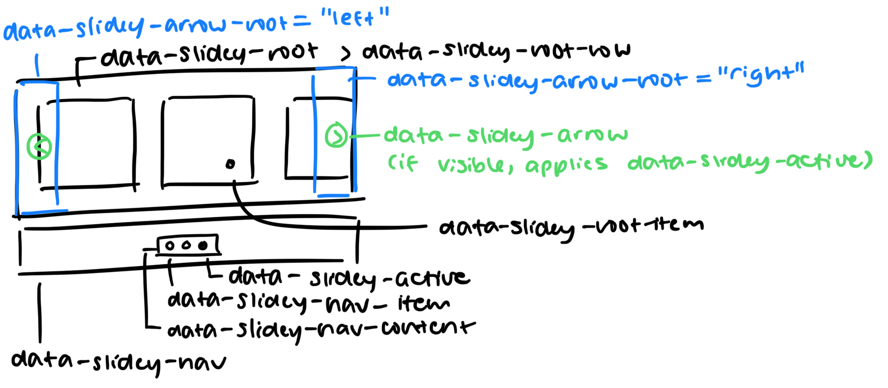

# slideyyy

A very bad not so good slideshow gallery component. Unstyled and smol (6.15 kB │ gzip: 1.99 kB).

Unfortunately, slidey is currently not very smart or adaptive, so some items may be cut off.

## Installation

```
pnpm add slideyyy
```

Yes, that's three y's.

## Usage

```html
<div class="slidey">
  <div>wow an item</div>
  <div>wow another item</div>
</div>
```

```ts
import { Slidey } from "./lib/slidey";

const slidey = new Slidey({
  container: document.querySelector(".slidey")!,
});

slidey.mount();
// slidey.unmount() restores the container innerHTML that was there previously
```

Slidey auto-creates a slideshow component on any container. By default, this is completely unstyled, but we can apply styles using data attribute selectors.



You can also find an example of some basic styles on GitHub.
